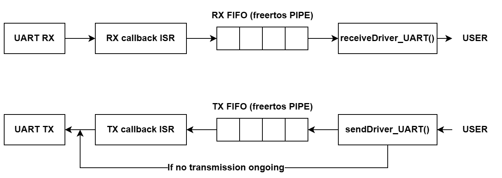

# STM32-FreeRTOS-UARTdriver
Simple interrupt mode UART driver for STM32 with an Unix-like send/receive interface using FreeRTOS queues.

For this purpose, the libary implements HAL interrupt callbacks **HAL_UART_RxCpltCallback()**, **HAL_UART_TxCpltCallback()** and **HAL_UART_ErrorCallback()**

## Usage

0. Configure the driver with configuration defines in **UARTdriver.h**: **MAX_UART_HANDLE**, **SERIAL_RX_BUFF_LEN** and **SERIAL_TX_BUFF_LEN**.
1. Initialize the driver at startup with **initDriver_UART()**.
2. Add UART devices to the driver with **addDriver_UART()** by passing the **huartHandle** UART handle structure pointer, the **irq** interrupt number corresponding to the specific UART and the **policyRX** RX policy, RX policy determines if newer (*keep_old*) or older (*keep_new*) bytes are discarded in case of full RX queue.
3. Send or read bytes to/from the uart by using the interface functions **sendDriver_UART()** and **receiveDriver_UART()**, just as you would do with Unix **write()** and **read()**. The image below shows the data flow of bytes from the interface functions to the device:

4. If needed, you can flush TX and RX queues with **flushTXDriver_UART()** and **flushRXDriver_UART()**.

